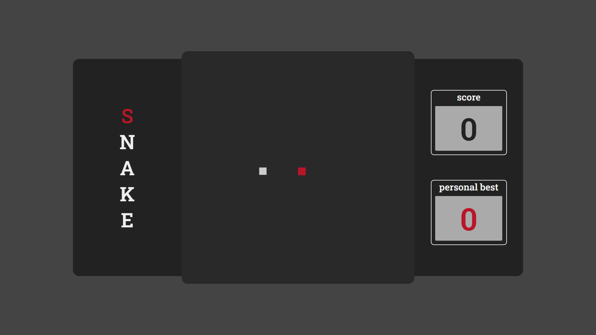

# snake-game

## Preview game

---

## Preview game running

---

## Preview gameplay

---

> ### 🕹️ Try it youtself

[>>>> CLICK HERE <<<<](https://henriqfelix.github.io/snake-game/) to play this game! ❗Not compatible on mobile devices❗

---

> ### ⚠️ Observation

The application was built based on this [video](https://www.youtube.com/watch?v=Hua1OSXitdQ).
The additional features are listed on next topic.

---

> ### ➕ Bonus features

- Progressively increased difficulty
- The snake cannot rotate at an angle of 180 degrees
- Local Storage to save personal best
- Style CSS 100% original
- WASD control

---

> ### 💻 Technologies used

- HTML
  - Canvas
  - Local Storage
- CSS
  - Keyframes
- Javascript
